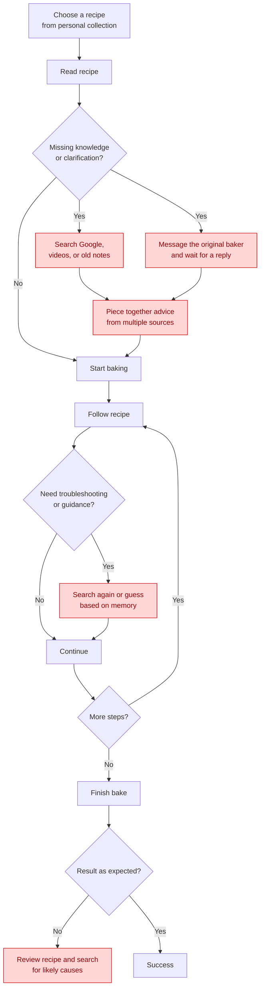
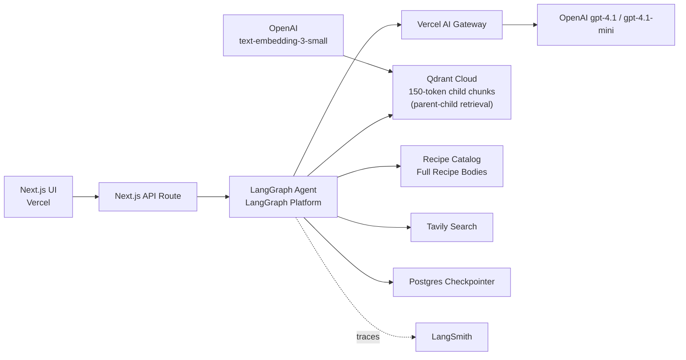
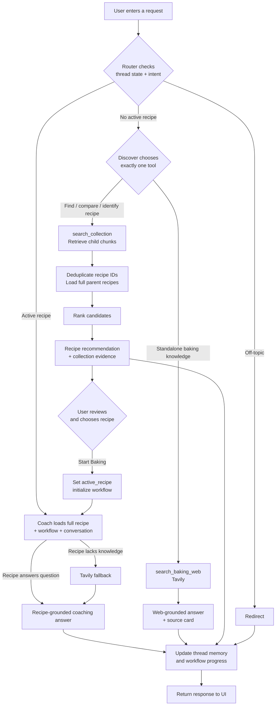

# Bake Me Up 🍞  Certification Challenge Submission

A **recipe companion**: it turns a collected recipe *and the knowledge around it* (notes, tips, troubleshooting, workflow) into a guided baking experience, with an AI companion (Kiwi) beside you.

---

# Task 1 - Problem, Audience, and Scope

## 1.1 Problem

Recipes can be saved, but the practical knowledge required to successfully recreate them (techniques, troubleshooting advice, instructor notes, and experience) is often lost or scattered across conversations, documents, and memory.

## 1.2 Why This Matters

The target user is a home baker who already has recipes they care about and wants to recreate them successfully. These recipes may come from family members, baking classes, friends, books, or a personal collection built over time.

While the recipe itself is usually available, the surrounding knowledge often is not. Technique explanations, troubleshooting advice, visual cues, and instructor notes are frequently missing from the written recipe. As a result, users switch between recipes, search engines, videos, and old messages to fill in the gaps. This process is slow, fragmented, and often leads to mistakes that are only discovered after the bake is complete.

## 1.3 Current Workflow

The diagram below shows how a baker typically recreates a recipe today. The highlighted steps represent common pain points where information is difficult to find, context switching occurs, or mistakes are likely.



## 1.4 Example Evaluation Questions

The following examples represent the types of interactions the system should be able to handle successfully.

| Category           | Example Input                                 | Expected Output                                        |
| ------------------ | --------------------------------------------- | ------------------------------------------------------ |
| Recipe Retrieval   | Which of my recipes uses yudane?              | Identify the correct recipe                            |
| Grounded Recipe QA | What temperature does the milk bread bake at? | Return the correct value from the recipe               |
| Recipe Knowledge   | What does the windowpane test mean?           | Explain the technique in context                       |
| Troubleshooting    | Why is my dough not rising?                   | Provide actionable guidance                            |
| Web Knowledge      | Can I substitute bread flour with AP flour?   | Provide baking guidance with caveats                   |
| Workflow Guidance  | What's my next step?                          | Return the correct next action                         |
| Grounding          | What's the sodium content per slice?          | Acknowledge missing information instead of fabricating |
| Domain Boundaries  | What's a good stock to buy?                   | Decline and stay within scope                          |


# Task 2 - Proposed Solution & Architecture

## 2.1 Solution

> The challenge is not helping users find recipes. The challenge is helping them successfully recreate recipes they already care about.

Bake Me Up is an AI baking companion that helps users find recipes from a personal collection, preserve the practical knowledge around them, and complete them through recipe-aware, stateful coaching.

## 2.2 Infrastructure Diagram

The system separates the browser experience, agent orchestration, private recipe knowledge, public web knowledge, memory, and observability.



What technologies make up my system:

| Component           | Choice                                             | Why I chose it                                                                                                        |
| ------------------- | -------------------------------------------------- | --------------------------------------------------------------------------------------------------------------------- |
| LLMs                | OpenAI `gpt-4.1` (chat) + `gpt-4.1-mini`           | The larger model handles coaching, synthesis, and ranking, while the mini model handles lower-cost routing decisions. |
| LLM gateway         | Vercel AI Gateway                                  | It provides one OpenAI-compatible interface for model access and keeps model configuration centralized.               |
| Agent orchestration | LangGraph                                          | It gives me explicit routing, persisted thread state, and clear traces for the Discover, Coach, and Redirect paths.   |
| Tools               | `search_collection` and Tavily `search_baking_web` | The collection tool searches private recipe data, while Tavily fills public baking-knowledge gaps.                    |
| Embedding model     | `text-embedding-3-small`                           | It is inexpensive and sufficient for the small, curated recipe corpus.                                                |
| Vector database     | Qdrant Cloud                                       | It stores dense fixed-150 recipe chunks (each tagged with its parent `recipe_id`) for parent-child discovery retrieval. |
| Memory              | LangGraph checkpointer backed by Postgres          | It preserves the active recipe, workflow progress, and conversation across turns.                                     |
| Monitoring          | LangSmith                                          | It exposes routing, retrieval, tool calls, prompts, latency, and failure traces.                                      |
| Evaluation          | RAGAS + custom hit@3 + LLM judge                   | The combination measures retrieval, grounding, correctness, and performance tradeoffs.                                |
| User interface      | Next.js                                            | It supports a responsive browser experience across phone and laptop.                                                  |
| Deployment          | Vercel + LangGraph Platform                        | Vercel hosts the frontend, while LangGraph Platform hosts the stateful backend agent.                                 |
| Recipe storage      | `catalog.json` + normalized recipe bodies          | The catalog supports lightweight discovery, while the complete recipe body supports grounded coaching.                |


## 2.3 Agent Workflow



The user begins in the Kitchen by entering either a recipe request or a baking question. The router first checks the current LangGraph thread state. Off-topic requests are sent to Redirect. When no recipe is active, the Discover node chooses exactly one tool: `search_collection` for finding, identifying, comparing, or recommending recipes from the private collection, or `search_baking_web` for standalone baking knowledge that requires public information. Collection results are ranked and returned as recipe recommendations with visible retrieval evidence; web answers include visible Tavily sources.

The user reviews the recommendation and provides the human approval step by selecting a recipe or clicking **Start Baking**. The system then stores the selected recipe as `active_recipe` and enters Coach Mode. Coach Mode loads the complete recipe, workflow state, and conversation history directly into context rather than retrieving fragments. It answers from the recipe first and calls Tavily only when the recipe cannot support the answer. The final response, workflow progress, and conversation are saved to the thread so the experience continues across later turns and steps.

---

# Task 3 - Dealing with the Data

## 3.1 Data Sources and External APIs

Bake Me Up uses three primary sources of information: a personal recipe collection, public baking knowledge, and workflow state.

### Personal Recipe Collection (Private Data / RAG)

The private knowledge base consists of six recipes collected from handwritten notes, PDFs, and baking-class handouts. The recipes are manually cleaned and stored in `data/recipes/`. Each recipe contains more than ingredients and instructions. It also includes:

- instructor tips
- troubleshooting guidance
- recipe summaries
- technique notes
- and workflow information

where the goal is to preserve not only the recipe itself, but also the practical knowledge required to successfully reproduce it.

Examples of questions supported by the collection include:

- Which recipe uses yudane?
- When is the butter added?
- How long is the final proof?
- What temperatures should I watch for during cheesecake baking?

### External Knowledge (Tavily Search)

Tavily provides access to public baking knowledge that does not exist inside the recipe collection.

Typical use cases include:

- ingredient substitutions
- baking science
- unfamiliar techniques
- and general troubleshooting

Examples include:

- Why does yudane make bread softer?
- Can I substitute bread flour with all-purpose flour?
- Why is my dough not rising in a cold kitchen?

Tavily is used as a knowledge source only. Recipe discovery remains grounded in the curated recipe collection rather than searching public recipes.

### Workflow State

Each recipe contains workflow metadata describing:

- current step
- next step
- completion criteria
- and recipe progress

This information is parsed into structured workflow state that tracks the current step, next step, and completion criteria, and supports questions such as:

> What's next?

without requiring retrieval or web search.

## 3.2 How the Data Sources Interact

Bake Me Up follows a local-first approach.

### Discovery (Recipe Unknown)

When no recipe is active, the user is typically trying to identify or select a recipe. The application performs **parent-child retrieval** over fixed-150 recipe chunks in Qdrant (retrieve child chunks, dedupe by `recipe_id`, load the full matched recipes), then recommends one or more matching recipes.

Examples include:

- Which recipe uses yudane?
- What can I make with cream cheese?
- I want something fluffy and not too sweet.

For standalone baking-knowledge questions that are not tied to a specific recipe, the agent can use Tavily instead.

Examples include:

- Why does yudane make bread softer?
- What happens if I overproof dough?

### Coaching (Recipe Known)

The recipe collection remains the primary source of truth throughout the baking workflow. Once a recipe has been selected, the complete recipe is loaded directly into the model context. The active recipe, workflow state, and conversation history become the primary information sources for the agent. If the recipe does not contain enough information, Tavily is available as a fallback.

This creates a simple hierarchy:

```text
Recipe unknown
→ Retrieval

Recipe known
→ Full recipe context

Recipe cannot answer
→ Tavily fallback
```

## 3.3 Default Retrieval and Chunking Strategy

### Production Retrieval Strategy: Parent-Child

Recipe discovery uses **parent-child retrieval**. Each recipe's cleaned prose is split into fixed **150-token child chunks**, embedded with OpenAI `text-embedding-3-small`, and stored in Qdrant with the parent **`recipe_id` on every chunk** (the child→parent link). On a discovery query the system:

1. retrieves the top child chunks (dense cosine search),
2. **dedupes by `recipe_id`** to identify the matching recipes (**top_k = 3**),
3. loads the **full parent recipe** for each and ranks/answers from those complete recipes.

The child chunks give precise recipe *identification*; the full parent recipe gives the ranker complete, non-fragmented context to recommend from and answer grounded ("which recipe uses yudane?", "something fluffy and not too sweet"). Discovery questions are recipe-level, so the retrieval unit that matters is the whole recipe: children locate it, the parent answers it. Recipe attributes (taste, texture, time, occasion, summary) live in the committed catalog and feed the ranker.

### Coaching Strategy

Once a recipe is selected, retrieval is no longer necessary. The cleaned recipes range from approximately 700-1,060 tokens, which fits comfortably within the model context window. Loading the full recipe allows the agent to reason across without losing context between sections:

- ingredients,
- instructions,
- workflow steps,
- instructor tips,
- and troubleshooting notes

This is particularly important for questions that require information from multiple parts of the recipe.

### Structured Data vs Embedded Data

Recipes use a hybrid format consisting of YAML metadata and Markdown content. This keeps machine-oriented workflow metadata separate from the content used for semantic retrieval. Embedded content includes:

- ingredients,
- recipe instructions,
- instructor tips,
- troubleshooting guidance,
- recipe summaries.

Parsed (non-embedded) content includes:

- workflow state,
- equipment metadata,
- scaling information,
- completion criteria.

## 3.4 Baseline vs. production retrieval

The **baseline** (documented history) is conventional fixed-size **150-token chunk** retrieval that answers from the raw child chunks. **Production adopts parent-child** at child size 150 (retrieve children, dedupe by `recipe_id`, answer from the full parent recipes), which is the advanced retriever evaluated in **Task 6.1**. Production and the evaluation harness share the same child retrieval + parent-dedupe primitive (`retrieve_children` / `dedup_recipe_ids` in `agent/retrieval.py`), so **the evaluation measures the shipped retriever**, not a separate design. **Task 6.3** further evaluates increasing the child chunk size to 250. All three configs run on the same 6-recipe corpus, changing one variable at a time.

---

# Task 4 - End-to-End Agentic RAG Prototype

- Live app: **[https://bake-me-up.vercel.app](https://bake-me-up.vercel.app)**
- GitHub repository: **[https://github.com/xx257/bake-me-up](https://github.com/xx257/bake-me-up)**
- Demo video (Part 1): **[https://www.loom.com/share/ed627f9e859644ec8e0dd28c7af5895d](https://www.loom.com/share/ed627f9e859644ec8e0dd28c7af5895d)**
- Demo video (Part 2): **[https://www.loom.com/share/68a04162924943958895838c100113bc](https://www.loom.com/share/68a04162924943958895838c100113bc)**
- Frontend → Vercel
- Backend → LangGraph Platform

---

# Tasks 5 & 6 - Evaluation and Retrieval Improvements

## Evaluation Philosophy

Bake Me Up's primary experience is selecting a recipe and then baking with the full recipe loaded into context. Because coaching does not depend on retrieval, the evaluation focuses on the parts of the system where retrieval actually matters:

- identifying the correct recipe,
- retrieving recipe knowledge,
- and answering grounded baking questions before a recipe is active.

All evaluation code lives under `backend/eval/` and is isolated from the production application.

```bash
uv run --project backend --group eval python backend/eval/build_collections.py
uv run --project backend --group eval python backend/eval/run_eval.py
uv run --project backend --group eval python backend/eval/run_behavior.py
```

---

# Task 5 - Test Dataset and Evaluation Harness

## 5.1 Test Dataset

The evaluation dataset consists of 14 hand-written test cases grounded in the six-recipe corpus described in Task 3. The dataset is divided into two subsets because retrieval quality and agent behavior are evaluated independently.

### Retrieval Subset (10 cases)

The retrieval subset evaluates whether the system can:

- identify the correct recipe,
- retrieve relevant recipe knowledge,
- answer recipe-specific questions,
- and reason across multiple sections of a recipe.

The questions cover four categories:

| Category | Example |
|-----------|-----------|
| Recipe Identification | Which recipe uses yudane? |
| Concept Retrieval | Which recipe is the most time-consuming? |
| Grounded Lookup | When is the butter added? |
| Cross-Section Reasoning | What is the full proofing schedule? |

Each example contains:

- a question
- one or more expected recipe IDs
- and a reference answer

Several questions intentionally avoid direct keyword matching so retrieval quality and answer quality can be evaluated separately.

### Behavior Subset (4 cases)

The behavior subset evaluates the production LangGraph workflow.

These cases verify that the agent:

- retrieves from the recipe collection when appropriate,
- uses Tavily for standalone baking knowledge,
- redirects off-topic questions,
- and handles recipe-specific knowledge gaps correctly.

The four behavior cases are:

| Case | Expected Behavior |
|--------|--------|
| "Something fluffy and not too sweet" | Discover → `search_collection` |
| "Why does yudane make bread softer?" | Tavily web search |
| "What's the weather?" | Redirect |
| "How much sodium is in a slice?" (recipe active) | Recipe-first + Tavily fallback |

## 5.2 Evaluation Harness

To avoid relying on intuition alone, a lightweight evaluation harness was built using deterministic metrics, LLM judging, and RAGAS.

### Retrieval Quality

**recipe_id_hit@3**

The primary retrieval metric. A result is counted as correct when at least one expected recipe ID appears within the top three retrieved recipes. Because this metric only compares IDs, it provides a deterministic measure of retrieval performance.

### Answer Quality

**answer_correctness**

Generated answers are compared against reference answers using a fixed LLM judge prompt and model. Scores range from 1-5. Reported values include:

- mean correctness score
- pass rate at ≥4

This metric measures whether the answer would be useful and complete from a user's perspective.

### RAG Quality

RAGAS (`ragas==0.2.15`) is used to measure:

- Faithfulness
- Answer Relevancy

These metrics help determine whether answers remain grounded in retrieved information and whether they address the user's question.

### Performance Metrics

The harness also records:

- average context tokens,
- latency.

These metrics become important when comparing retrieval strategies in Task 6.

## 5.3 Baseline Findings

The baseline evaluation revealed two useful observations.

First, retrieval performance was already strong. Recipe identification achieved `recipe_id_hit@3` values between 0.90 and 1.00, suggesting that the correct recipe was usually being found. Second, answer quality did not always follow retrieval quality. Several questions required information from multiple parts of a recipe. Even when the correct recipe was retrieved, chunk-level context sometimes lacked enough information to generate a complete answer. The behavior evaluation also validated most of the application workflow. Three of the four behavior cases followed the intended routing path. The one miss was a nutrition-related question that was answered from model knowledge instead of triggering the Tavily fallback.

These findings suggested that retrieval was no longer the primary bottleneck. The primary opportunity for improvement was therefore increasing answer context after retrieval rather than improving recipe identification itself. The next question became whether providing richer context after retrieval could improve answer quality.

### Behavior Evaluation Results

| Case | Outcome |
|--------|--------|
| Collection request | ✅ |
| Standalone baking knowledge | ✅ |
| Off-topic redirect | ✅ |
| Pinned recipe nutrition question | ⚠️ Did not invoke Tavily |

The nutrition question highlighted a limitation in the current implementation. Although Tavily fallback is available, the model answered using recipe information and parametric knowledge instead of performing a web search. This behavior is surfaced directly rather than patched because it reflects how the system currently behaves.

### Trace Review (LangSmith)

A representative discovery trace follows this path:

```text
User
  ↓
Route
  ↓
Discover
  ↓
search_collection
  ↓
Qdrant Retrieval
  ↓
Rank
  ↓
Recommendation Cards
```

For the query:

> "I want something fluffy and not too sweet"

the agent selected `search_collection`, retrieved candidate recipes from Qdrant, and ranked them into recommendation cards. The trace shows the retrieved candidates, similarity scores, and final recommendation decision.

---

# Task 6 - Retrieval Improvements

## 6.1 Advanced Retrieval Technique: Parent-Child Retrieval

Parent-child retrieval was chosen because small child chunks are useful for locating the relevant recipe, while returning the full parent recipe gives the model enough context to answer questions that span multiple sections.

This is a good fit for Bake Me Up because recipe questions often depend on ingredients, steps, timing, and troubleshooting notes together rather than on a single isolated chunk.

## 6.2 Experimental Design

Two physical collections were created:

- `bake_me_up_recipes_eval_150`
- `bake_me_up_recipes_eval_250`

Three configurations were evaluated:

| Config | Retrieval Collection | Answer Context |
|----------|----------|----------|
| Fixed-150 (Baseline) | eval_150 | Retrieved child chunks |
| Parent-Child-150 | eval_150 | Full recipe bodies |
| Parent-Child-250 | eval_250 | Full recipe bodies |

The first comparison isolates the effect of parent-child retrieval because both systems retrieve identical child chunks.

The second comparison isolates the effect of chunk size.

### Results

| Config | recipe_id_hit@3 | Correctness (Mean) | Pass@≥4 | Faithfulness | Relevancy | Avg Context Tokens | Avg Latency (ms) |
|----------|----------|----------|----------|----------|----------|----------|----------|
| Fixed-150 | 0.90 | 3.8 | 0.70 | 0.88 | 0.61 | 418 | 1732 |
| Parent-Child-150 | 0.90 | 4.4 | 0.80 | 0.85 | 0.75 | 1294 | 3235 |
| Parent-Child-250 | 1.00 | 4.7 | 0.90 | 0.88 | 0.69 | 1760 | 1781 |

Latency was approximately 1.7-1.8 seconds for Fixed-150 and Parent-Child-250. Parent-Child-150 measured 3.2 seconds in this run because of one unusually slow judge call, so context-token usage is the more reliable efficiency signal for this comparison. Parent-child trades roughly 3x more tokens for higher answer quality.

## 6.3 Additional Improvement: Chunk Size

In addition to evaluating the retrieval strategy itself, I evaluated chunk granularity as an independent system parameter because chunk size directly affects retrieval recall, answer quality, and context cost. The baseline parent-child implementation used 150-token child chunks. A second experiment increased child size to 250 tokens while keeping the remainder of the retrieval pipeline unchanged.

## 6.4 Findings and Tradeoffs

### Parent-Child Retrieval Improved Answer Quality

The most important comparison is Fixed-150 versus Parent-Child-150. Because both systems retrieve identical child chunks, any difference comes from the answer context rather than retrieval itself. Parent-child retrieval did not improve which recipes were retrieved; it improved the quality of answers generated from those retrieved recipes:

- correctness from **3.8 → 4.4**
- pass@≥4 from **70% → 80%**
- answer relevancy from **0.61 → 0.75**

A representative example was:

> "When is the butter added?"

The fixed-chunk baseline answered incorrectly from an isolated fragment, while parent-child retrieval answered correctly using information from the complete recipe.

### Parent-Child Retrieval Does Not Fix Retrieval Misses

One concept-based query ("Which recipe is the most time-consuming?") retrieved the wrong recipe. Both systems failed because the retrieval stage failed. This demonstrates that retrieval quality and answer generation quality are separate concerns.

### Larger Child Chunks Improved Recall

Increasing child size from 150 to 250 tokens improved:

- recipe_id_hit@3 from **0.90 → 1.00**
- correctness from **4.4 → 4.7**

The tradeoff was:

- larger context size (1294 → 1760 tokens),
- slightly lower answer relevancy (0.75 → 0.69).

This represents a quality-versus-cost tradeoff rather than a universally better configuration.

## 6.5 Final Decision

**Parent-Child-150 is the retriever shipped in production.** The live `discover` lane retrieves fixed-150 child chunks, dedupes by `recipe_id`, and answers from the full parent recipes (top_k = 3).

Compared with the fixed-chunk baseline it significantly improved answer quality while retrieving the same recipes; larger 250-token children improved recall further but the extra context cost was not justified at the current corpus size. Because production and the evaluation harness share the same child-retrieval + parent-dedupe primitive (`agent/retrieval.py`), these results reflect the **deployed system**, not a separate prototype. The evaluation was re-run against this design and the outcomes held.

For Bake Me Up's recipe-centric workflow, Parent-Child-150 provides the best balance between retrieval quality, answer quality, and efficiency.

# Task 7 - Next Steps

## What I Would Keep

### Stateful LangGraph Architecture

Existing three-node architecture (Discover, Coach, Redirect) proved to be simple, easy to reason about, and easy to evaluate. I explored more complex routing approaches during development, but the simpler graph produced clearer behavior, cleaner traces, and fewer failure modes.

### Retrieval Only When Necessary

I would keep the decision to use retrieval only when the relevant recipe is unknown. Task 6 reinforced this decision. The evaluation showed that retrieval quality matters during recipe identification and knowledge lookup, while coaching benefits more from having access to the complete recipe than repeatedly retrieving fragments.

### Local-First Knowledge

Recipe collection remains the primary source of truth. External search complements the collection rather than replacing it. This creates a more grounded user experience and makes the system easier to reason about.

### Evaluation-Driven Development

Rather than assuming a more advanced retriever would be better, I built a dataset, measured the results, and used the findings to guide decisions. The parent-child evaluation revealed both its strengths and limitations, which informed the final design.

## What I Would Improve

### Personal Recipe Ownership

Current collection is intentionally small and curated for the certification challenge. The next step would be allowing users to upload, organize, and manage their own recipes, notes, and baking knowledge. This would transform Bake Me Up from a fixed recipe collection into a personal baking knowledge base.

### Richer Knowledge Representation

Current recipes are primarily stored as structured text. Future versions could represent recipes as richer knowledge objects containing ingredients, workflow stages, troubleshooting guidance, substitutions, instructor notes, and previous baking outcomes. This would support more targeted retrieval and reasoning.

### More Context-Aware Coaching

Current coaching workflow uses recipe context and conversation state. Future versions could incorporate additional execution state such as timers, completed steps, user confirmations, baking history, and previous mistakes. This would allow Kiwi to provide more proactive guidance instead of relying entirely on user questions.

### Multimodal Troubleshooting

One of the most interesting future directions is image-based troubleshooting. Users could upload photos of dough development, proofing progress, or finished bakes. The agent could combine recipe knowledge, workflow state, and image observations to provide more precise feedback during baking.

### Evaluation and Performance Improvements

Current evaluation focuses on recipe identification and grounded knowledge lookup because these are the areas where retrieval has the greatest impact. Future evaluations would continue measuring: recipe identification accuracy, answer correctness, faithfulness, answer relevancy, latency, context size, and routing behavior.

## Reflection

The most important lesson from this project was learning to connect product goals, system design, and evaluation. Rather than adopting techniques because they are more advanced, the better question is whether they solve a real user problem and whether the improvement justifies the additional complexity.

The project originally started with a much heavier RAG-centric design. My first instinct was to use retrieval for almost every interaction. As the product evolved, it became clear that retrieval was only difficult when the recipe was unknown. Once a user selects a recipe, the challenge is no longer finding information; it is helping the user successfully execute the recipe. That insight led to one of the most important architecture decisions in the project: use retrieval during discovery, but load the full recipe into context during coaching. The result was a simpler system that was easier to reason about, more reliable in practice, and easier to evaluate.

The evaluation work reinforced this thinking. The parent-child retrieval experiment showed that more retrieval is not automatically better; what mattered was providing the right context at the right stage of the workflow. In several cases, answer quality improved not because retrieval became more sophisticated, but because the model had access to a more complete view of the recipe.

Another takeaway was the value of reducing complexity. Several ideas explored during development, such as additional retrieval layers, more routing logic, and more elaborate workflows, were ultimately removed because they did not improve the user experience. The final architecture is simpler than many of the early designs, but it is also easier to explain, easier to evaluate, and more closely aligned with the core goal of helping someone successfully recreate a recipe they care about.

Going forward, I expect this project to influence how I approach AI systems in general. Instead of starting with a particular technique, I will start with the user problem, identify where intelligence is actually needed, and use evaluation to justify architectural decisions. In many cases, the best solution may not be the most sophisticated one; it may be the one that introduces the least complexity while still solving the problem well.

---