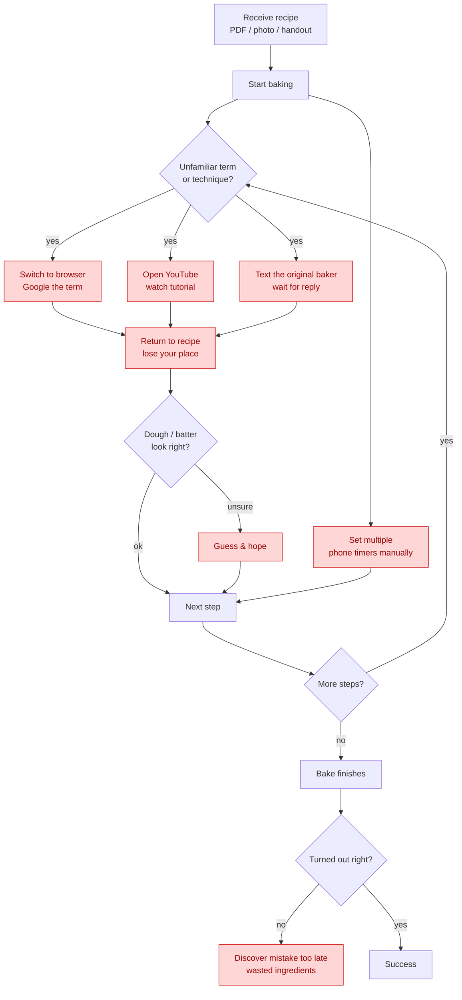
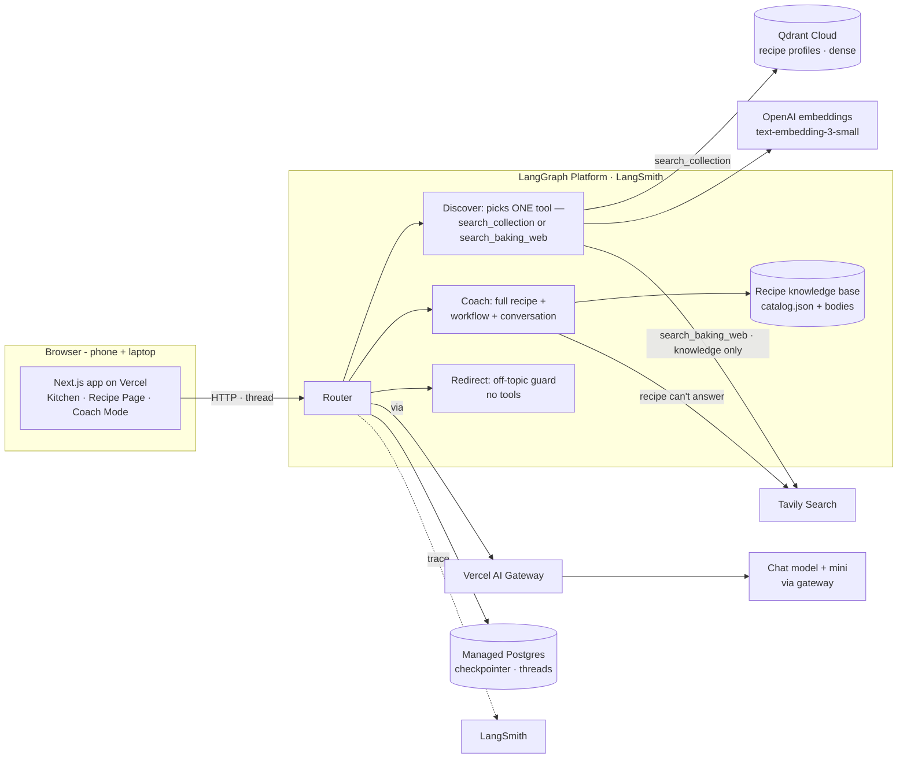
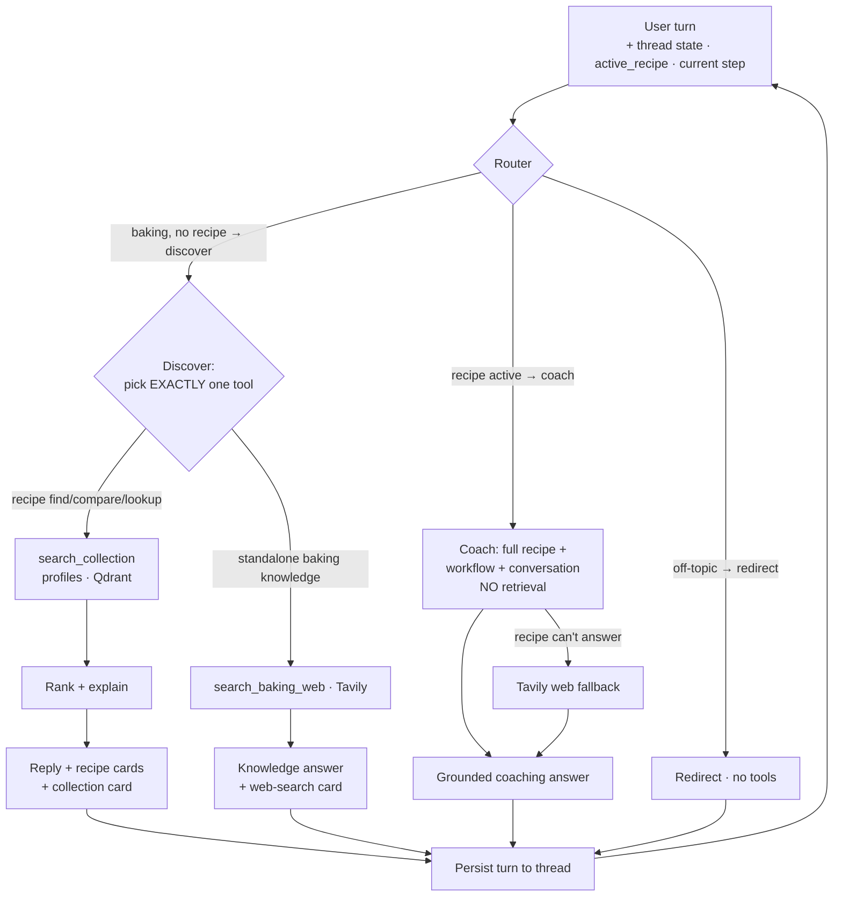

# Bake Me Up 🍞 — Certification Challenge Submission

A **recipe knowledge & execution platform**: it turns a collected recipe — *and the knowledge around
it* (notes, tips, troubleshooting, workflow) — into a guided baking experience, with an AI companion
(Kiwi) beside you.

- **Live app:** <https://bake-me-up.vercel.app>
- **Repo:** <https://github.com/xx257/bake-me-up>
- **Demo (Loom, ≤10 min):** _link — TBD_

> This document is the complete write-up — every deliverable (Tasks 1–7 + Final Submission). The
> runnable code is in `backend/` (LangGraph agent + `backend/eval/` harness) and `frontend/`.

---

# Task 1 — Problem, Audience, and Scope

### 1.1 Problem (one sentence)
People collect recipes from many places — family, friends, baking classes, cookbooks, blogs, personal
experimentation — and usually preserve the *recipe*, but lose the **knowledge required to
successfully recreate it**: why a step is written that way, what the dough should look like at each
stage, which mistake caused last time's failure, what "medium-soft peak" means, what to watch during
proofing, and which substitutions are safe.

### 1.2 Why this is a problem for this user
**Who / what.** The user is someone recreating recipes they care about from a *personal collection* —
a grandparent's bread handout, a baking-class sheet, a screenshotted note, a cookbook page — not a
polished test-kitchen site. They want to **understand** the recipe, **execute** it successfully
(ideally first try), **troubleshoot** when it goes sideways, and eventually **pass it on** — all
without pinging the original baker for every ambiguity.

**Today / why it's not enough.** These recipes list ingredients and steps but assume knowledge the
author never wrote down — what "tangzhong," "windowpane," or "proof until doubled" actually mean, how
sticky the dough *should* feel, what to do if the kitchen is cold. So the baker juggles the source
recipe alongside Google searches, YouTube tutorials, texts to the original baker (who may not reply in
time), and several phone timers, while guessing at dough state. This constant context-switching breaks
concentration, generic web answers aren't tied to *this* recipe's ratios or intent, and mistakes
surface only after the bake fails — wasting ingredients and eroding confidence. The recipe survived;
the *experience needed to reproduce it* did not.

**The journey Bake Me Up supports:** Preserve → Discover → Understand → Execute → Troubleshoot →
Replicate.

### 1.3 Current ("today") workflow — with pain points
Pain points (red) are where the workflow is slow, repetitive, or error-prone: context-switching to
browser/YouTube, waiting on the original baker, manual timer juggling, guessing dough state, and
discovering failure too late.



### 1.4 Evaluation questions / input–output pairs
Rows 1–6, 10–12 exercise the first-pass knowledge & coaching flow (discovery, grounded Q&A, web
fallback, honest grounding); rows 7–9 (`scale()` / `timeline()`) are **future tools**.

| #  | Category            | Example question (input)                                | Expected output shape                                   |
|----|---------------------|--------------------------------------------------------|---------------------------------------------------------|
| 1  | RAG / retrieval     | "Which of my recipes uses tangzhong?"                  | Names the correct recipe from the corpus                |
| 2  | RAG / grounded QA   | "What temperature does the milk bread bake at?"        | Exact temp from that recipe, cites the recipe           |
| 3  | RAG / grounded QA   | "How long is the first proof for the sourdough?"       | Correct duration from the recipe                        |
| 4  | Terminology         | "What does the 'windowpane test' mean?"                | Clear explanation, tied to the current step             |
| 5  | Web search (Tavily) | "Can I substitute bread flour with AP flour here?"     | Substitution guidance from web + recipe-specific caveat |
| 6  | Web search (Tavily) | "Why is my dough not rising in a cold kitchen?"        | Actionable web-grounded troubleshooting                 |
| 7  | Tool: scale()       | "Scale this 8-serving recipe to 12."                   | Deterministic, ratio-correct amounts, units preserved   |
| 8  | Tool: scale()       | "Halve the butter and eggs only."                      | Correct partial scaling                                 |
| 9  | Tool: timeline()    | "Build me a timeline if I want it done by 5 PM."       | Ordered schedule respecting proof/bake dependencies     |
| 10 | Guidance / tracking | "What's my next step?"                                 | Correct next step given session state                   |
| 11 | Grounding / honesty | "What's the sodium content per slice?" (not in recipe) | States it's not in the recipe; offers to search; no fabrication |
| 12 | Out-of-scope        | "What's a good stock to buy?"                          | Politely declines, stays in the baking domain           |

---

# Task 2 — Proposed Solution & Architecture

### 2.1 Solution (one sentence)
Bake Me Up turns a collected recipe *and its surrounding knowledge* into a guided baking experience —
helping users **preserve, discover, understand, execute, troubleshoot, and replicate** the recipes
they care about, with an AI companion (Kiwi) beside them.

**The journey:** Preserve → Discover → Understand → Execute → Troubleshoot → Replicate. Recommendation
exists but is *supporting*; the core value is helping people successfully *execute* recipes they
already care about.

### 2.2 Knowledge architecture
| Source | Nature | Powers | Retrieval? |
|--------|--------|--------|------------|
| **Workflow State** | Deterministic (recipe step graph + session) | current/next step, progress, completion | **No** — deterministic |
| **Recipe Knowledge Base** (primary) | Curated collection: recipes + notes + tips + troubleshooting | discovery, recommendation, grounded Q&A | **Only for discovery** (recipe unknown) |
| **External Baking Knowledge** (Tavily) | Open-world web | standalone baking-knowledge questions (discovery) + technique/substitution a known recipe can't answer (coach) | Web tool — knowledge only, never to find recipes |

### 2.3 Infrastructure diagram



| Component | Choice | Rationale (one line) |
|-----------|--------|----------------------|
| User interface | Next.js on Vercel | The journey app (Discover → Understand → Coach) on phone + laptop |
| Agent framework | LangGraph (Python) | Explicit graph gives controllable routing + built-in thread memory |
| Router | LLM classifier (mini) | Recipe active → coach (no RAG); baking → discover; off-topic → redirect |
| Recipe knowledge base | Committed `catalog.json` + Qdrant profiles | Ships recipe bodies (coach) + profiles (discovery) with the deploy |
| LLM | Chat + mini models via Vercel AI Gateway | chat coaches/ranks/synthesizes; mini routes + authors the discovery tool's args |
| **LLM gateway** | **Vercel AI Gateway** | Required by Task 2; the chat LLM's `base_url` in the backend |
| Embedding model | OpenAI text-embedding-3-small | Cheap, high-quality; embeddings go direct to OpenAI |
| Vector database | Qdrant Cloud | Recipe profiles (dense) for discovery `search_collection` |
| Memory | LangGraph checkpointer (managed Postgres) | Thread-scoped memory; carries discovery → understanding → baking |
| External tool | Tavily Search | Web baking-knowledge tool (discovery + coach fallback); never finds recipes |
| Monitoring | LangSmith | Native tracing of routing, both discovery tools, fallback calls; visible UI cards |
| Evaluation | RAGAS + LLM-judge + deterministic checks | Retrieval metrics + judged answer quality |
| Deployment | Vercel (FE) + LangGraph Platform (BE) | Public endpoints; managed deploy with persistence |

### 2.4 Agent workflow



**How it solves the problem, end to end.** A turn arrives on a **per-session thread**, so the backend
already holds the conversation (memory). The **router** (mini model) is context-gated: a **recipe
active** → **Coach**; a baking turn → **Discover**; off-topic → **Redirect**.

- **Coach (recipe known)** loads the **full recipe** into context and reasons over *Active Recipe +
  Workflow State + Conversation* — **no per-question retrieval** (one recipe fits the window). Workflow
  control ("what's next?") is **deterministic** from the current-step state, not a search. When the
  recipe genuinely can't answer, it falls back to **Tavily**. Human-in-the-loop: the user advances
  steps with an explicit **"I'm Ready"** control, so the chat and the workflow never drift.
- **Discover (no recipe active)** binds **two tools** and the model calls **exactly one** — the choice
  *is* the intent (no separate classifier). `search_collection` → profile retrieval + rank for finding
  a recipe; `search_baking_web` (Tavily) → a standalone baking-knowledge question the corpus can't
  answer. A missing/ambiguous choice retries once, then a graceful error — never silently defaults.
- **Redirect** declines off-topic turns — no tools, no retrieval.

Every LLM call routes through the **Vercel AI Gateway**; LangSmith traces the whole path; both
discovery tools surface as visible UI cards ("Searched your collection" / "Searched the web").

**Requirements coverage:** LLM gateway (Vercel AI Gateway) ✅ · memory (LangGraph checkpointer,
Postgres) ✅ · runs in a phone/laptop browser (Next.js on Vercel) ✅.

---

# Task 3 — Dealing with the Data

### Data sources & the external API
- **Recipe Knowledge Base (your own data / RAG):** **6 recipes**, manually cleaned from
  handwritten / PDF / instructor-handout sources in `data/recipes/`. Beyond ingredients and steps,
  each carries the *surrounding knowledge* — instructor tips, troubleshooting Q&A, per-step notes, and
  a workflow step graph. The corpus overlaps on purpose (milk bread, roll cake, anpan, cheesecake,
  cookies, mochi share terms like *meringue*, *yudane*, *water bath*) so discovery has a realistic job:
  pick the *right* recipe among *similar* ones.
- **External knowledge (Agent) — Tavily Search:** baking knowledge outside the corpus (open-world
  substitutions, general technique). It is a **discovery tool** for standalone baking questions and a
  **coach fallback** for a known recipe — **knowledge-only, never used to fetch recipes**.
- **Workflow state (deterministic):** the per-step `next_step` chain + completion criteria, parsed
  into a step graph — drives "what's next?" without retrieval.

### How they interact
The agent prefers the **local knowledge base**. In discovery it picks one tool — `search_collection`
to find/recommend a recipe, or `search_baking_web` for a standalone baking question the corpus can't
answer (grounding the reply in web results). In coaching it answers from the full recipe and reaches
for Tavily only for what the recipe doesn't cover. So the collection owns "which recipe / what does
*this* recipe say"; Tavily owns open-world "general baking knowledge." Workflow control is
deterministic and uses neither. Recipes compile to a committed `catalog.json` (ships with the deploy)
and embed into Qdrant via `backend/agent/ingest.py`.

### Default chunking strategy — and why
**Fixed-size dense chunking (150 tokens, no overlap).** Cleaned recipe prose is split into 150-token
chunks (`cl100k_base`, the tokenizer `text-embedding-3-small` uses), each tagged with its `recipe_id`
so chunks map back to the recipe. **Why 150 — measured, not guessed:**

| Unit | min | median | mean | p75 | p90 | max |
|------|-----|--------|------|-----|-----|-----|
| Natural content units (step / tip / troubleshooting Q&A), tokens | 15 | **50** | 51 | 62 | 82 | **138** |

150 comfortably exceeds the largest single content unit (138), so a chunk never fragments below one
semantic unit while merging ~3 small units — exactly the naive fixed-size behavior a baseline should
have. Full recipes run ~700–1060 tokens, so **coaching needs no retrieval** — the whole recipe fits
the window.

> **Note on live vs. experiment:** live *discovery* ranks over compact **recipe profiles**; the
> 150-token chunk retriever is the **Task-6 experiment baseline** (built in `agent/ingest.py` +
> `retrieve_recipes`, evaluated in Task 6, not wired into the live discovery path).

---

# Task 4 — End-to-End Agentic RAG Prototype (built + deployed)

**Built:** the full journey works end to end — **Kitchen (Discover)** → **Recipe page (Understand)**
→ **Coach Mode (Execute)**. The `discover` node binds two tools and calls exactly one
(`search_collection` for finding recipes, `search_baking_web` for standalone knowledge), both surfaced
as visible tool cards; the `coach` node loads the full recipe and grounds every answer in *recipe +
workflow state + conversation*, with per-step conversation while the shared thread carries the whole
session; off-topic turns hit the `redirect` guard.

**Production-grade stack:** Next.js on Vercel · Python **LangGraph** on **LangGraph Platform** · chat
+ mini models via the **Vercel AI Gateway** · **Qdrant Cloud** (profiles) · OpenAI embeddings ·
**Tavily** · **LangSmith** tracing · Postgres checkpointer (memory).

**Deployed to a public endpoint:**
- **Live app:** <https://bake-me-up.vercel.app>
- **Frontend → Vercel** (GitHub push to `main` auto-deploys). **Backend → LangGraph Platform** (managed
  service, graph id `agent`, Postgres checkpointer). A Next.js server route
  (`frontend/app/api/chat/route.ts`) proxies to the LangGraph deployment, holding the API key
  server-side and running each turn on the per-session `threadId`.

---

# Task 5 — Test Dataset + Evaluation Harness

All eval code is isolated under `backend/eval/` and never runs in production.

**Dataset** — `backend/eval/testset.jsonl`, **14 hand-written cases** grounded in the 6-recipe corpus,
split into two subsets scored separately:
- **retrieval subset (10)** — balanced beyond keyword matching: identification (4), concept (2, no
  literal keyword), grounded lookup (1), and cross-section reasoning (3, answers spanning multiple
  recipe sections). Each row carries `expected_recipe_ids` (a list) + a reference answer.
- **behavior subset (4)** — routing/tool behavior, run through the **production graph**.

**Harness** (RAGAS + a locked judge):
- `recipe_id_hit@3` (**primary**, deterministic) — did an expected recipe id appear in the retrieved ids?
- `answer_correctness` — LLM judge vs reference, **1–5**; report mean + pass@≥4; prompt & model **frozen** across configs.
- `faithfulness`, `answer_relevancy` — RAGAS (`ragas==0.2.15`).
- `average_context_tokens`, `latency` — the cost side of the tradeoff.

**Conclusions (Task 5.3):** retrieval identification is strong (`hit@3` 0.90–1.00); answer quality is
driven by *how much context the generator gets*, not just whether the right recipe is found —
motivating the Task 6 experiment. The behavior subset routed **3/4** as designed; the one miss (a
pinned-recipe nutrition question answered from parametric knowledge instead of invoking Tavily) is
**surfaced honestly** — the web fallback is available but model-discretionary.

**Reproduce** (all eval code lives in `backend/eval/`; results in `backend/eval/results/`):

```bash
uv run --project backend --group eval python backend/eval/build_collections.py   # (re)build eval collections
uv run --project backend --group eval python backend/eval/run_eval.py            # retrieval subset (Task 6)
uv run --project backend --group eval python backend/eval/run_behavior.py        # behavior subset (Task 5)
```

---

# Task 6 — Improving the Prototype (two isolated improvements)

Two distinct levers, each measured on the same harness with a before/after.

### 6.1 — Advanced retrieval technique: **parent-child**
Retrieve small child chunks to *identify* the source recipe, then answer from the **full recipe body**
(precise identification + complete, non-fragmented generation context). **Comparison A** isolates it:
`fixed-150` and `parent-child-150` **search the same collection**, so child hits are identical by
construction (asserted row-by-row) — only the answer context differs.

### 6.3 — Change to a second piece: **child chunk size** (indexing/chunking config)
**Comparison B** (`parent-child-150` → `parent-child-250`) isolates the child-chunk-size variable.

### Results (retrieval subset, n = 10)
| config | recipe_id_hit@3 | correctness (mean / pass@≥4) | faithfulness | answer_relevancy | avg_context_tokens | median latency |
|---|---|---|---|---|---|---|
| **fixed-150** (baseline) | 0.90 | 3.8 / 0.70 | 0.84 | 0.61 | **418** | 1.6 s |
| **parent-child-150** (Task 6.1) | 0.90 | **4.4 / 0.80** | 0.88 | **0.74** | 1294 | 1.6 s |
| **parent-child-250** (Task 6.3) | **1.00** | **4.7 / 0.90** | 0.92 | 0.69 | 1760 | 1.4 s |

**Findings (hard evidence).**
- **Task 6.1 (Comparison A):** with identical retrieval, full-recipe context clearly improves answer
  quality — correctness **3.8 → 4.4**, pass@≥4 **0.70 → 0.80**, answer_relevancy **0.61 → 0.74**. Sharpest
  case — *"when is the butter added?"*: fixed-150 answered **wrong** from an out-of-context fragment
  (score 1); parent-child got it right (5).
- **Task 6.3 (Comparison B):** larger 250-token children caught the one concept query the smaller
  children missed (`hit@3` **0.90 → 1.00**) and lifted correctness **4.4 → 4.7** — but at ~35% more
  tokens and slightly diluted relevancy (0.74 → 0.69). A real, nuanced tradeoff, not a free win.
- **Honest limit:** parent-child **cannot** fix a *retrieval* miss (retrieval and generation are
  independent stages) — the fixed/pc-150 concept-query miss fails both. **parent-child-150 is the
  balanced choice**; 250 is the option when identification recall matters more than token cost.

---

# Task 7 — Next Steps

### Keep (for Demo Day)
- **The three-lane graph (`route → discover · coach · redirect`)** — shallow, explicit state, easy to
  reason about, trace, and evaluate. The discovery node's own tool choice is the routing decision (no
  extra classifier).
- **Retrieval only when the relevant recipe is unknown** — discovery retrieves; coaching loads the full
  recipe. Simpler and more reliable than per-turn RAG, and it produced a cleaner evaluation strategy.
- **Local-first + Tavily fallback** — grounded in the curated collection; the web is a knowledge tool,
  never a recipe finder. Clear separation of private domain knowledge vs. public sources.
- **Observable agent behavior** — retrieval candidates and web results surfaced as UI cards; easier to
  debug and evaluate, honest in live demos.

### Improve (after Demo Day)
- **Larger, user-owned knowledge base** — recipe uploads, versioning, annotations; a bigger corpus
  makes advanced retrieval more meaningful and strengthens the parent-child case.
- **Web recipe discovery + ingest** — extend Tavily beyond knowledge-only: find a recipe off the web
  and ingest it (structure → profile + body → Qdrant), so a "no match" becomes a saved recipe.
- **Richer knowledge representation** — recipes as structured objects (ingredients, stages,
  troubleshooting, substitutions, notes, prior outcomes) so retrieval reasons over baking *concepts*.
- **More context-aware Coach Mode** — timers, completed steps, confirmations, baking history → proactive
  guidance.
- **Multimodal troubleshooting** — images of dough/proofing/finished bakes combined with recipe +
  workflow state.
- **Expand the eval** — re-run metrics at corpus scale; add routing-accuracy and broader
  through-the-graph behavior coverage. A key lesson: **evaluation should drive architecture decisions**,
  not the other way around.

---

# Final Submission

- **Public GitHub repo:** <https://github.com/xx257/bake-me-up> — this write-up and all code
  (`backend/` LangGraph agent + `backend/eval/` harness, `frontend/` Next.js app).
- **Live application:** <https://bake-me-up.vercel.app>
- **Loom demo (≤10 min):** _link — TBD_ (records the use case + a live walkthrough: discovery,
  standalone-knowledge web fallback, Coach Mode, off-topic redirect).
