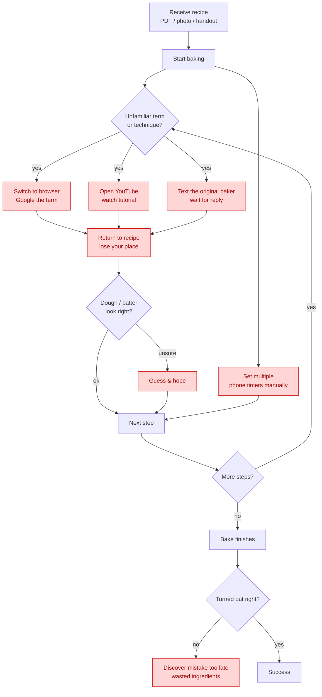

# Task 1 — Problem, Audience, and Scope

## 1.1 Problem (one sentence)

Home bakers who receive recipes from an instructor, family member, or friend often
fail to reproduce them successfully because the shared instructions omit the tacit,
experience-based knowledge needed to execute each step correctly.

## 1.2 Why this is a problem for this user

**Who / what.** The user is a home baker recreating a *specific person's* recipe — a
family bread handout, an instructor's croissant sheet, a screenshotted note — not a
polished, test-kitchen cookbook. They want to reproduce it faithfully and
independently, ideally on the first try, without pinging the original baker for every
ambiguity.

**Today / why it's not enough.** These recipes list ingredients and steps but assume
knowledge the author never wrote down — what "tangzhong," "windowpane," or "proof
until doubled" actually mean, how sticky the dough *should* feel, what to do if the
kitchen is cold. So the baker juggles the source recipe alongside Google searches for
terms, YouTube tutorials, texts to the original baker (who may not reply in time), and
several phone timers, while guessing at dough state. This constant context-switching
breaks concentration, the generic web answers aren't tied to *this* recipe's ratios or
intent, and mistakes surface only after the bake fails — wasting ingredients and
eroding confidence.

## 1.3 Current ("today") workflow — with pain points

Pain points (red) are where the workflow is slow, repetitive, or error-prone:
context-switching to browser/YouTube, waiting on the original baker, manual timer
juggling, guessing dough state, and discovering failure too late.

## 1.4 Evaluation questions / input–output pairs

Consolidated list used to evaluate the application; also seeds the Task 5 test set.

| #  | Category            | Example question (input)                                | Expected output shape                                   |
|----|---------------------|--------------------------------------------------------|---------------------------------------------------------|
| 1  | RAG / retrieval     | "Which of my recipes uses tangzhong?"                  | Names the correct recipe from the corpus                |
| 2  | RAG / grounded QA   | "What temperature does the milk bread bake at?"        | Exact temp from that recipe, cites the recipe           |
| 3  | RAG / grounded QA   | "How long is the first proof for the sourdough?"       | Correct duration from the recipe                        |
| 4  | Terminology         | "What does the 'windowpane test' mean?"                | Clear explanation, tied to the current step             |
| 5  | Web search (Tavily) | "Can I substitute bread flour with AP flour here?"     | Substitution guidance from web + recipe-specific caveat |
| 6  | Web search (Tavily) | "Why is my dough not rising in a cold kitchen?"        | Actionable web-grounded troubleshooting                 |
| 7  | Tool: scale()       | "Scale this 8-serving recipe to 12."                   | Deterministic, ratio-correct amounts, units preserved   |
| 8  | Tool: scale()       | "Halve the butter and eggs only."                      | Correct partial scaling                                 |
| 9  | Tool: timeline()    | "Build me a timeline if I want it done by 5 PM."       | Ordered schedule respecting proof/bake dependencies     |
| 10 | Guidance / tracking | "What's my next step?"                                 | Correct next step given session state                   |
| 11 | Grounding / honesty | "What's the sodium content per slice?" (not in recipe) | States it's not in the recipe; offers to search; no fabrication |
| 12 | Out-of-scope        | "What's a good stock to buy?"                          | Politely declines, stays in the baking domain           |
