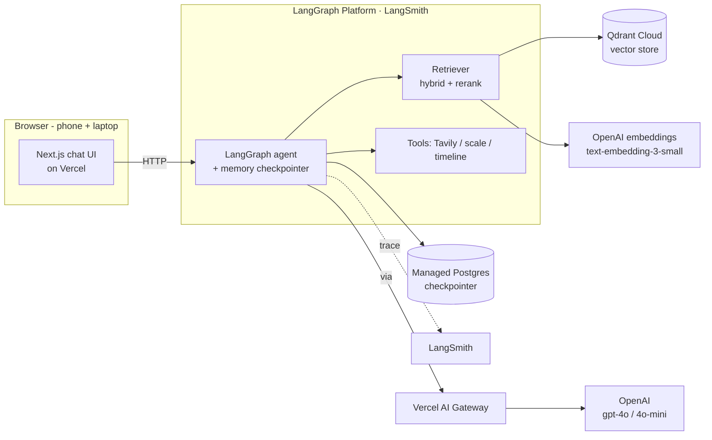
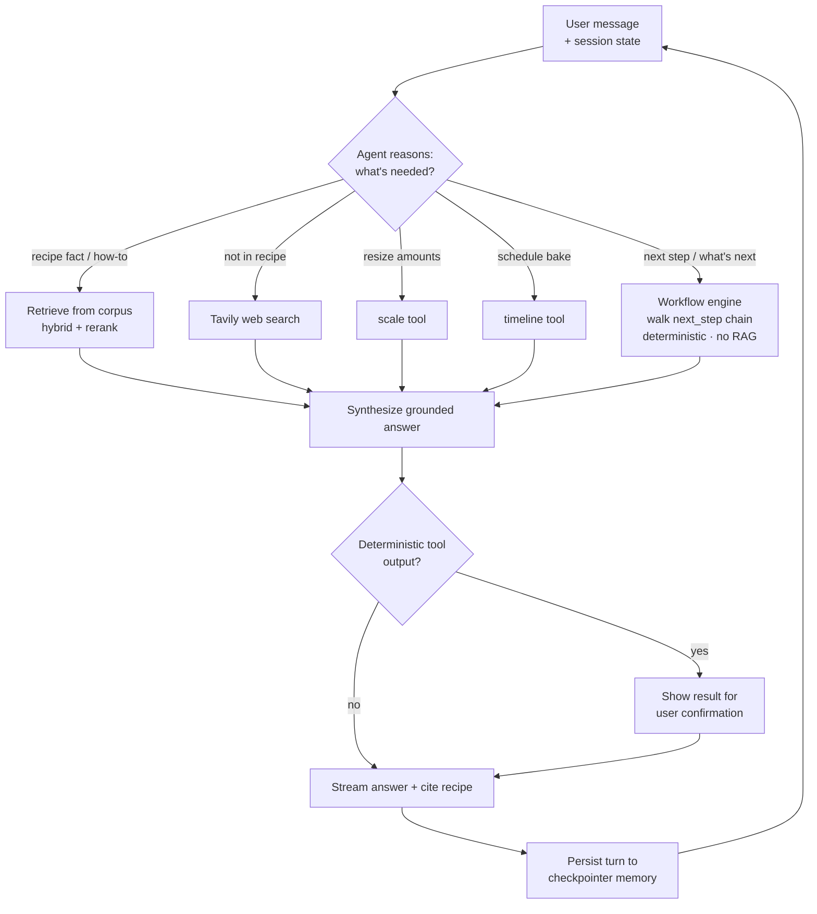

# Task 2 — Proposed Solution & Architecture

## 2.1 Solution (one sentence)

Bake Me Up is an agentic-RAG baking companion that turns a shared recipe into an
interactive, step-by-step session — answering questions grounded in that recipe,
explaining techniques, searching the web when the recipe doesn't cover it, and
generating exact ingredient scaling and a dependency-aware bake timeline.

### MVP priority (build order)

Not all five capabilities are equal. Build in strict priority so the supporting
tools can't block the MVP if implementation runs long.

**Core path (must ship):**
1. Select a recipe
2. Ask recipe-grounded questions → grounded answers (RAG)
3. Continue the baking session using memory ("what's next?" tracks active recipe + step)
4. Fall back to Tavily when the recipe is insufficient

**Supporting tools (ship if time allows):**
5. Scaling (`scale()`)
6. Single-recipe backward timeline (`timeline()`)

**Minimum successful demo:** a user selects a recipe, asks questions about it,
receives grounded answers, asks "what's next?", and the agent remembers the active
recipe and current step. That alone proves RAG, agent routing, memory, UI, and
deployment — the full cert-required stack.

## 2.2 Infrastructure diagram

### Why each component

| Component          | Choice                          | Rationale (one line)                                                        |
|--------------------|---------------------------------|----------------------------------------------------------------------------|
| User interface     | Next.js on Vercel               | Browser app runs on phone + laptop, zero-config public deploy               |
| Agent framework    | LangGraph (Python)              | Explicit graph gives controllable reasoning/tool routing + built-in memory |
| LLM                | OpenAI gpt-4o / gpt-4o-mini     | Strong instruction-following; mini keeps cost low for routing/simple turns  |
| **LLM gateway**    | **Vercel AI Gateway**           | Required by Task 2; low-risk integration — just the OpenAI client's `base_url` in the Python backend |
| Embedding model    | OpenAI text-embedding-3-small   | Cheap, high-quality, pairs natively with the LLM                            |
| Vector database    | Qdrant Cloud                    | Managed free tier; supports hybrid/dense retrieval and metadata filters     |
| Memory             | LangGraph checkpointer (managed Postgres) | Thread-scoped conversation memory (required); Postgres persistence is provided by LangGraph Platform |
| External tool      | Tavily Search                   | Agentic web search for substitutions/techniques beyond the corpus           |
| Deterministic tools| `scale()`, `timeline()`         | Precise math the LLM shouldn't hallucinate; clean deterministic eval targets|
| Monitoring         | LangSmith                       | Native LangGraph tracing of agent steps, tool calls, and retrieval; same platform as the deploy |
| Evaluation         | RAGAS + custom + LLM-judge      | RAG metrics + deterministic unit checks + judged guidance quality           |
| Deployment         | Vercel (FE) + **LangGraph Platform** (BE) | Public endpoints; managed LangGraph deploy (paid LangSmith) removes hand-rolled backend hosting and includes persistence |

## 2.3 Agent workflow

**Input → reasoning → retrieval/tools.** A turn begins with the user's message plus
persisted session state (active recipe, current step) loaded from the LangGraph
checkpointer. When a recipe is selected, its **ordered step graph** — parsed from the
per-step `#### Workflow` blocks (`next_step` chain + `completion` criteria) — is loaded
into session state. The agent's router node then decides intent: recipe-grounded
questions trigger **RAG** (hybrid dense + BM25 retrieval over Qdrant, then rerank the
top-k); questions the corpus can't answer trigger the **Tavily** web-search tool; amount
changes call the deterministic **`scale()`** tool; scheduling requests call
**`timeline()`**, which orders steps by their proof/bake dependencies. Step-navigation
turns ("what's next?", "am I done with this step?") are handled by a **deterministic
workflow engine** that walks the `next_step` pointer from `current_step` and surfaces
that step's `completion` cues — **no RAG**, so navigation is exact and repeatable. Every
LLM call routes through the **Vercel AI Gateway**.

**Synthesis → human review → output → memory.** Results are synthesized into a single
grounded answer that cites the source recipe. For the deterministic tools (scaling,
timeline) the app surfaces the computed result for a lightweight **user confirmation**
step before proceeding — the human-review checkpoint — since these change what the
baker will actually do. The final answer streams back to the browser, and the turn
(including the updated current step) is written back to the checkpointer so the next
message continues the same baking session. LangSmith traces the whole path for
evaluation and debugging.

### Requirements coverage (req.md Task 2)

- **LLM gateway** — Vercel AI Gateway in front of OpenAI.
- **Memory component** — LangGraph checkpointer (Postgres), thread-scoped.
- **Runs on phone and laptop in a browser** — Next.js web app on Vercel.
