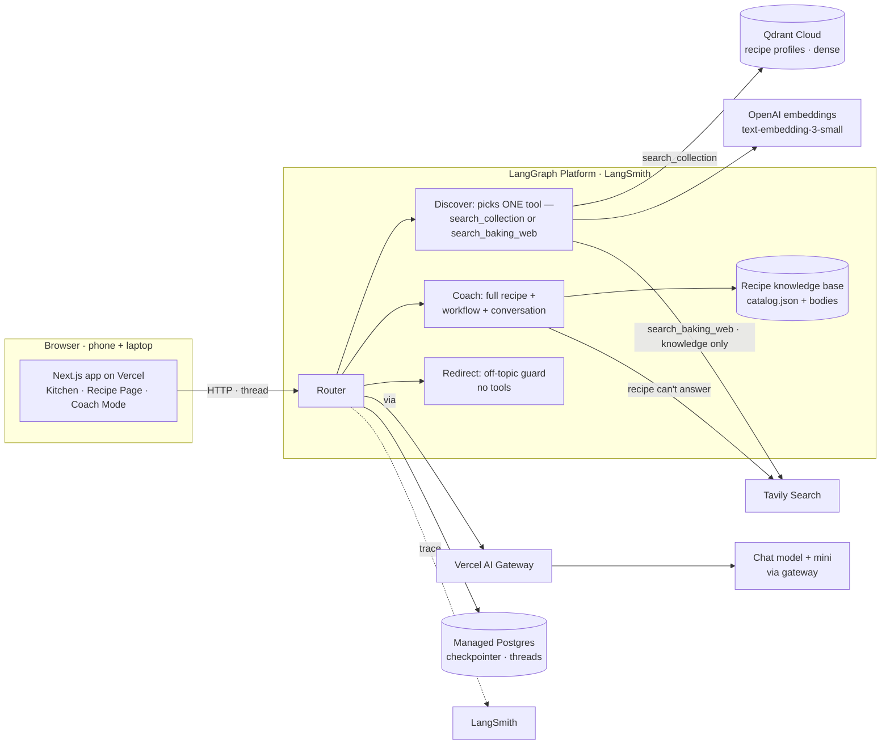
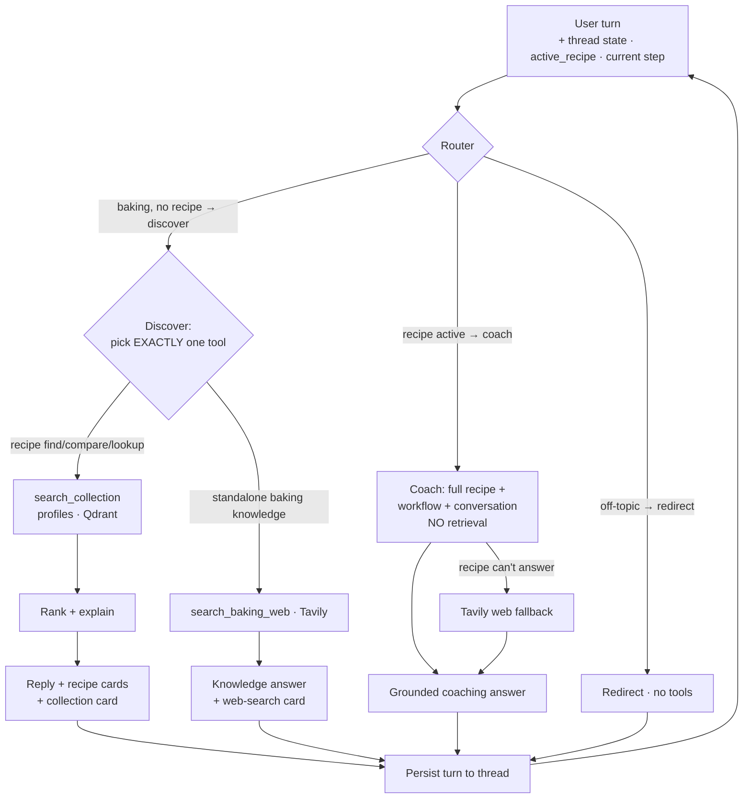

# Task 2 — Proposed Solution & Architecture

## 2.1 Solution (one sentence)

Bake Me Up is a **recipe knowledge & execution platform**: it turns a collected recipe —
*and the knowledge around it* (notes, tips, troubleshooting, workflow) — into a guided
baking experience, helping users **preserve, discover, understand, execute, troubleshoot,
and replicate** the recipes they care about, with an AI companion (Kiwi) beside them.

### The journey

```text
Preserve → Discover → Understand → Execute → Troubleshoot → Replicate
```

- **Preserve** — a recipe becomes a *structured knowledge asset*: ingredients, steps,
  instructor tips, troubleshooting notes, and per-step workflow.
- **Discover** — when the recipe (or knowledge) is *unknown*, retrieval finds it:
  "which recipe uses yudane?", "what can I make with cream cheese?", "something fluffy".
- **Understand** — read and ask about the recipe before starting ("why a water bath?",
  "what does medium-soft peak mean?").
- **Execute** — **Coach Mode**, the heart of the product: a calm step-by-step companion
  that knows the active recipe, the current step, and the conversation so far.
- **Troubleshoot** — recipe-specific recovery ("why did my cheesecake crack?"),
  supplemented by external baking knowledge only when the recipe can't answer.
- **Replicate** — share the recipe *plus* its notes, troubleshooting, and guidance so
  someone else can recreate it without the original baker present.

Recommendation still exists, but it is **supporting** (part of Discover) — the core value
is helping people *successfully execute* recipes they already care about.

**Minimum successful demo:** discover a recipe from a natural query → understand it →
Start Baking → the coach answers "what's next?" and "why did this happen?" grounded in the
recipe, remembering the session → falls back to the web only when the recipe can't answer.
That exercises retrieval, a stateful coaching agent, memory, external fallback, UI, and
deployment — the full cert-required stack.

## 2.2 Knowledge architecture

Three knowledge sources, each used only where it fits:

| Source | Nature | Powers | Retrieval? |
|--------|--------|--------|------------|
| **Workflow State** | Deterministic (from the recipe's step graph + session) | current step, next step, progress, completion | **No** — deterministic |
| **Recipe Knowledge Base** (primary) | The curated collection: recipes + notes + tips + troubleshooting | **discovery**, recommendation, recipe understanding, grounded Q&A | **Only for discovery** (recipe unknown) |
| **External Baking Knowledge** (Tavily) | Open-world web | **standalone baking-knowledge questions** in discovery (no matching recipe) + technique/substitution questions a *known* recipe can't answer (coach) | Web tool — knowledge only, never to find recipes |

**Retrieval only when it adds value.** When the **active recipe is unknown**, discovery
identifies the right recipe from the curated collection. When the **active recipe is already
known**, the coach needs no vector search — it reasons over *Active Recipe + Workflow State +
Conversation Context* directly (recipes are small enough to fit the model window). Tavily is
a **web tool for baking knowledge**, never used for recommendation, to find recipes on the
open web, or for workflow control.

## 2.3 Infrastructure diagram



### Why each component

| Component          | Choice                          | Rationale (one line)                                                        |
|--------------------|---------------------------------|----------------------------------------------------------------------------|
| User interface     | Next.js on Vercel               | The journey app (Discover → Understand → Coach) on phone + laptop           |
| Agent framework    | LangGraph (Python)              | Explicit graph gives controllable routing + built-in thread memory          |
| Router             | LLM classifier (mini)           | Recipe active → coach (no RAG); baking → discover; off-topic → redirect      |
| Recipe knowledge base | Committed `catalog.json` + Qdrant profiles | Ships full recipe bodies (for the coach) + recipe profiles (for discovery `search_collection`) with the deploy |
| LLM                | Chat + mini models via Vercel AI Gateway | chat model coaches, ranks, and synthesizes; mini model routes + authors the discovery tool's search args |
| **LLM gateway**    | **Vercel AI Gateway**           | Required by Task 2; the chat LLM's `base_url` in the Python backend          |
| Embedding model    | OpenAI text-embedding-3-small   | Cheap, high-quality; embeddings go direct to OpenAI                          |
| Vector database    | Qdrant Cloud                    | **Recipe profiles** (dense) for discovery `search_collection` retrieval      |
| Memory             | LangGraph checkpointer (managed Postgres) | Thread-scoped memory; context carries discovery → understanding → baking |
| External tool      | Tavily Search                   | Web tool for baking knowledge beyond the corpus — a discovery tool (standalone questions) and a coach fallback; never used to find recipes |
| Monitoring         | LangSmith                       | Native LangGraph tracing of routing, both discovery tools, and fallback calls; tools surface as visible UI cards |
| Evaluation         | RAGAS + custom + LLM-judge      | Retrieval metrics + discovery quality + judged coaching quality             |
| Deployment         | Vercel (FE) + **LangGraph Platform** (BE) | Public endpoints; managed deploy (paid LangSmith) with persistence   |

## 2.4 Agent workflow



**Coaching is the heart.** A turn arrives on a **per-session thread**, so the backend
already holds the conversation. The **router** (mini model) is context-gated: if a recipe is
**active** it goes straight to **Coach**; a baking turn goes to **Discover**; an off-topic
turn is **Redirected**.

- **Coach (recipe known)** loads the **full recipe** into context and reasons over
  *Active Recipe + Workflow State + Conversation* — **no per-question retrieval** (one recipe
  fits the window; coaching benefits from seeing every step). **Workflow control is
  deterministic** ("what's next?" is answered from the current-step state, not a search).
  When the recipe genuinely can't answer (a general technique/substitution), it falls back
  to **Tavily**. The same lane serves two framings — coaching an *in-progress* bake vs.
  *evaluating* a recipe the user is considering (both keep recipe-first, Tavily-as-fallback).
- **Discover (no recipe active)** binds **two tools** and the model calls **exactly one** —
  the choice *is* the intent, so there's no separate classifier node:
  - `search_collection` → profile retrieval over the collection for finding, comparing,
    identifying, or recommending a recipe ("something fluffy", "which recipe uses yudane?").
  - `search_baking_web` (Tavily) → a **standalone baking-knowledge** question the recipes
    don't cover ("why does yudane make bread softer?", "what is Dutch-process cocoa?"),
    answered from the web and never used to fetch recipes. A missing/ambiguous tool choice
    retries once, then returns a graceful error — it never silently defaults to a recipe.
- **Redirect** declines off-topic turns and steers back to baking — no tools, no retrieval.

**Memory.** Every turn is written back to the thread via the LangGraph Platform
checkpointer, so context set during discovery/understanding is available while the coach
helps during baking. Every LLM call routes through the **Vercel AI Gateway**; LangSmith
traces the whole path.

**Why this split.** Discovery is a *retrieval + knowledge* problem ("which recipe? — or a
baking question we don't stock a recipe for"); coaching is a *reasoning/state* problem ("help
me finish this one"). Keeping the graph to three lanes — and letting the discovery node's own
tool choice decide collection-vs-knowledge rather than adding a classifier node — keeps the
system simple, explainable, and honestly evaluable, matching the principle that not every
interaction needs RAG.

## 2.5 Certification architecture story

- **Personal Knowledge Base** — a curated recipe collection carrying recipes *plus* notes,
  tips, and troubleshooting as structured knowledge.
- **Retrieval-Augmented Discovery** — dense retrieval over that knowledge base for
  recommendation, recipe search, and knowledge lookup (used only when the recipe is unknown).
- **Stateful Agent Experience** — a LangGraph agent with per-session thread memory drives
  recipe evaluation, guided baking, deterministic workflow progression, and conversational
  coaching.
- **External Knowledge Integration** — Tavily web search fills baking-knowledge gaps the local
  corpus can't cover: a discovery tool for standalone questions (no matching recipe) and a
  coach fallback for a known recipe — surfaced as a visible "Searched the web" card. Today it is
  deliberately knowledge-only and never fetches recipes. *Planned next:* extend the web tool to
  **recipe discovery** — find a recipe off the web and **ingest** it (structure → profile + body
  → Qdrant), turning a "no match" into a saved collection recipe.

Together these form the journey **Preserve → Discover → Understand → Execute → Replicate**,
with the AI companion supporting the user throughout.

### Requirements coverage (req.md Task 2)

- **LLM gateway** — Vercel AI Gateway in front of OpenAI (chat).
- **Retrieval / vector store** — Qdrant Cloud, dense recipe profiles (discovery `search_collection`).
- **Memory component** — LangGraph checkpointer (Postgres), thread-scoped.
- **External tool** — Tavily web search (discovery knowledge tool + coach fallback).
- **Runs on phone and laptop in a browser** — Next.js web app on Vercel.
- **Monitoring** — LangSmith tracing.
