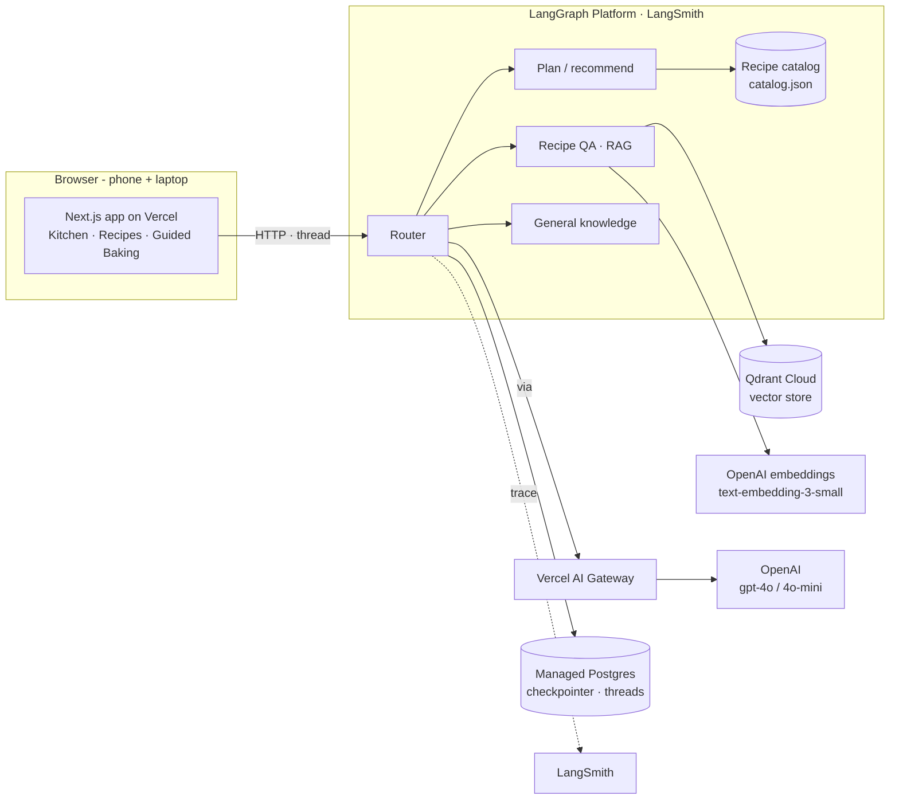
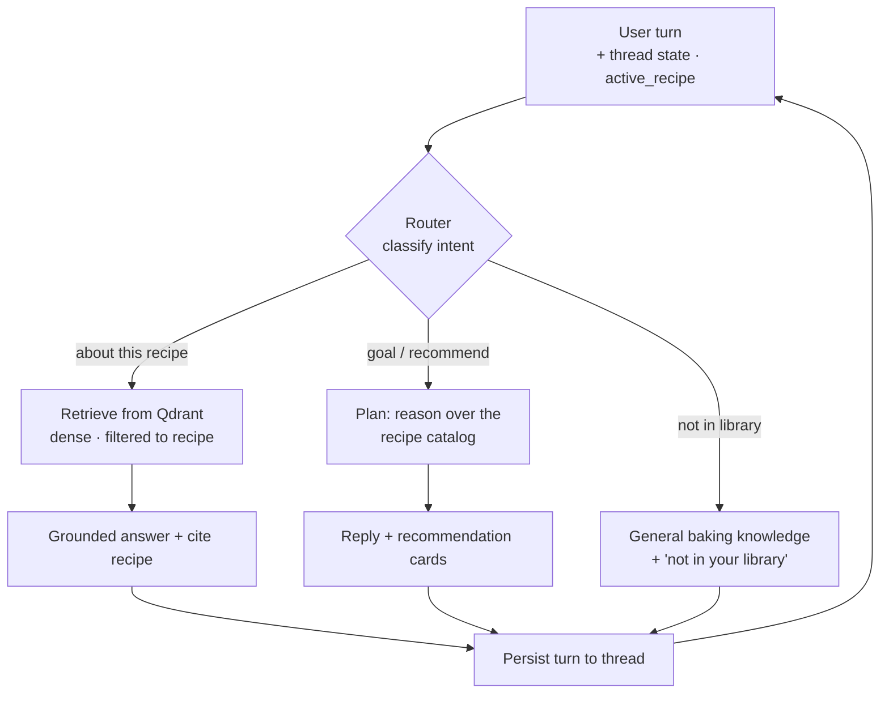

# Task 2 — Proposed Solution & Architecture

## 2.1 Solution (one sentence)

Bake Me Up is an **agentic baking companion**: it starts from *what the user wants to
bake*, recommends a recipe from the library (with reasons), then coaches them through it
step-by-step — answering grounded in that recipe, and falling back to general baking
knowledge when the library doesn't cover it.

### MVP flow (intent-first)

The experience begins with the user's goal, not the recipe grid.

**Core path (shipping):**
1. **Kitchen** — describe a goal (time, ingredients, occasion, skill level).
2. **AI planning** — the agent reasons over the recipe **catalog** and returns
   recommendations, each with a short "why".
3. **Choose a recipe** → recipe detail.
4. **Start Baking** → **Guided Baking** mode (one step at a time, progress, prev/next).
5. **AI coach** — recipe-grounded RAG, aware of the current step, that **remembers the
   planning goal** across the session (thread memory); **general-knowledge fallback**
   when the question isn't about a library recipe.

**Supporting / next:** Tavily web search, `scale()`, `timeline()`, and a deterministic
workflow engine (walk the per-step `next_step` chain) — none block the MVP.

**Minimum successful demo:** describe a goal → get a recommendation → open the recipe →
ask a grounded question → Start Baking → the coach answers "what's next?" while
remembering the goal. That proves planning, RAG, agent routing, memory, UI, and
deployment — the full cert-required stack.

## 2.2 Infrastructure diagram

### Why each component

| Component          | Choice                          | Rationale (one line)                                                        |
|--------------------|---------------------------------|----------------------------------------------------------------------------|
| User interface     | Next.js on Vercel               | Recipe-first app (Kitchen → Recipes → Guided Baking) on phone + laptop      |
| Agent framework    | LangGraph (Python)              | Explicit graph gives controllable routing across lanes + built-in memory    |
| Router             | LLM classifier (gpt-4o-mini)    | Sends each turn to plan / recipe_qa / general based on intent + active recipe|
| Recipe catalog     | Committed `catalog.json`        | Lets the planner reason over the whole library without hitting the corpus at runtime |
| LLM                | OpenAI gpt-4o / gpt-4o-mini     | Strong instruction-following; mini keeps routing cheap                       |
| **LLM gateway**    | **Vercel AI Gateway**           | Required by Task 2; the chat LLM's `base_url` in the Python backend          |
| Embedding model    | OpenAI text-embedding-3-small   | Cheap, high-quality; embeddings go direct to OpenAI                          |
| Vector database    | Qdrant Cloud                    | Managed; dense retrieval + payload filter to the active recipe              |
| Memory             | LangGraph checkpointer (managed Postgres) | Thread-scoped memory (required); the planning goal carries into baking |
| External tool      | Tavily Search *(next)*          | Web search for substitutions/techniques beyond the corpus                   |
| Deterministic tools| `scale()`, `timeline()` *(next)*| Precise math the LLM shouldn't hallucinate; clean deterministic eval targets|
| Monitoring         | LangSmith                       | Native LangGraph tracing of routing, retrieval, and tool calls              |
| Evaluation         | RAGAS + custom + LLM-judge      | RAG metrics + recommendation quality + judged guidance quality             |
| Deployment         | Vercel (FE) + **LangGraph Platform** (BE) | Public endpoints; managed deploy (paid LangSmith) with persistence   |

## 2.3 Agent workflow

**Intent → lane.** A turn arrives on a **per-session thread** (created in the Kitchen,
carried into the recipe page), so the backend already holds the conversation — including
the user's planning goal. The **router** (gpt-4o-mini) classifies the turn, constrained
by whether a recipe is active: with no active recipe (the Kitchen) it chooses **plan** or
**general**; on a recipe page it chooses **recipe_qa** or **general**.

- **plan** reasons over the committed recipe **catalog** (title, category, difficulty,
  est. time, key ingredients, description) and returns 1–3 recommendations with a reason
  each; the structured cards ride back in the run output for the UI to render.
- **recipe_qa** runs **dense retrieval** over Qdrant filtered to the active recipe, then
  answers grounded and cited (declines when the answer isn't in the recipe).
- **general** answers from general baking knowledge and notes the recipe isn't in the
  user's library (they can add it later).

**Memory.** Every turn is written back to the thread via the LangGraph Platform
checkpointer, so the goal set during planning ("I only have an hour") is available when
the coach later helps during baking. Guided Baking (current step + next step) is surfaced
to the coach so "what's next?" resolves without the user restating context. Every LLM
call routes through the **Vercel AI Gateway**; LangSmith traces the whole path.

**Planned lanes.** Tavily (web fallback), `scale()`/`timeline()` (deterministic tools),
and a no-RAG workflow engine that walks each recipe's `#### Workflow` `next_step` chain
are additive lanes off the same router.

### Requirements coverage (req.md Task 2)

- **LLM gateway** — Vercel AI Gateway in front of OpenAI (chat).
- **Memory component** — LangGraph checkpointer (Postgres), thread-scoped; goal persists
  planning → baking.
- **Runs on phone and laptop in a browser** — Next.js web app on Vercel.
