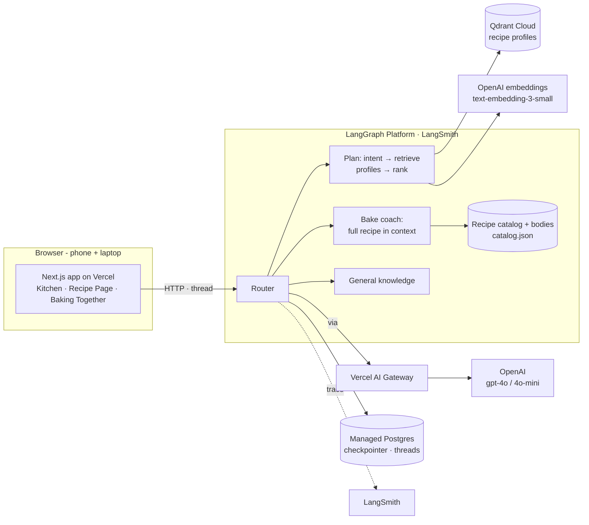
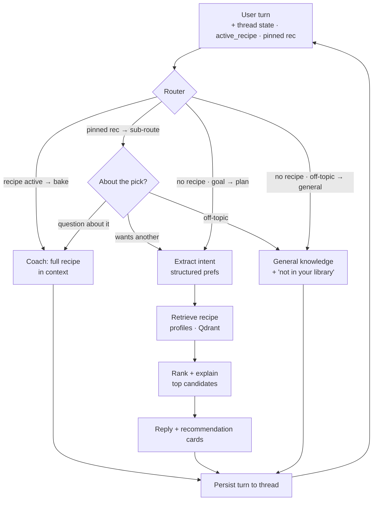

# Task 2 — Proposed Solution & Architecture

## 2.1 Solution (one sentence)

Bake Me Up is an **agentic baking companion**: it starts from *what the user wants to
bake*, recommends a recipe from the library (with reasons), then coaches them through it
step-by-step — answering grounded in that recipe, and falling back to general baking
knowledge when the library doesn't cover it.

### MVP flow (intent-first)

The experience begins with the user's goal, not the recipe grid.

**Core path (shipping):**
1. **Kitchen** — describe a goal (time, ingredients, occasion, skill level).
2. **AI planning** — extract intent → retrieve matching recipe **profiles** → rank &
   explain the best picks, each with a short "why". The Kitchen keeps a **single pinned
   recommendation**: follow-ups about that pick route to the coach (so the retrieval card
   doesn't re-fire), while "show me another / something different" starts a fresh search.
3. **Choose a recipe** → **Recipe Page** (Knowledge, *Coach Available*): a recipe-first
   reference to understand and prepare; the coach is secondary and on-demand.
4. **Start Baking** → **Baking Together** (Experience, *Coach Active*): a full-screen calm
   instructor — **recipe title + step progress bar** → current step → *Ready when* / tip →
   **I'm Ready** (attached to the checkpoint), with a **Kiwi** coaching note and suggested
   questions alongside. Optimized for **confidence, not completion**.
5. **AI coach** — loads the **full recipe into context**, aware of the current step, and
   **remembers the planning goal** across the session (thread memory);
   **general-knowledge fallback** when nothing in the library matches.

**Two surfaces, two jobs.** The Recipe Page answers "what do I do?" (structure); the coach
answers "what if something goes wrong?" (flexibility). On the Recipe Page the coach is
*available* (a quiet Ask-Coach overlay); in Baking Together the coach is *active* (the primary
experience). A single agent and one per-session thread span both, so context never repeats.

**Supporting / next:** Tavily web search, `scale()`, `timeline()`, and a deterministic
workflow engine (walk the per-step `next_step` chain) — none block the MVP.

**Minimum successful demo:** describe a goal → get a recommendation → open the recipe →
ask a grounded question → Start Baking → the coach answers "what's next?" while
remembering the goal. That proves planning, RAG, agent routing, memory, UI, and
deployment — the full cert-required stack.

## 2.2 Infrastructure diagram

### Why each component

| Component          | Choice                          | Rationale (one line)                                                        |
|--------------------|---------------------------------|----------------------------------------------------------------------------|
| User interface     | Next.js on Vercel               | Journey app (Kitchen → Recipe Page → Baking Together) on phone + laptop     |
| Agent framework    | LangGraph (Python)              | Explicit graph gives controllable routing across lanes + built-in memory    |
| Router             | LLM classifier (gpt-4o-mini)    | Recipe active → bake; pinned pick → bake/plan/general; else plan or general |
| Recipe catalog     | Committed `catalog.json`        | Ships profile fields (for planning) + full recipe bodies (for the coach) with the deploy |
| LLM                | OpenAI gpt-4o / gpt-4o-mini     | 4o coaches/ranks; mini does routing + intent extraction                     |
| **LLM gateway**    | **Vercel AI Gateway**           | Required by Task 2; the chat LLM's `base_url` in the Python backend          |
| Embedding model    | OpenAI text-embedding-3-small   | Cheap, high-quality; embeddings go direct to OpenAI                          |
| Vector database    | Qdrant Cloud                    | **Recommendation profiles** for planning-mode retrieval (recipe-chunk RAG retained for eval/future) |
| Memory             | LangGraph checkpointer (managed Postgres) | Thread-scoped memory (required); the planning goal carries into baking |
| External tool      | Tavily Search *(next)*          | Web search for substitutions/techniques beyond the corpus                   |
| Deterministic tools| `scale()`, `timeline()` *(next)*| Precise math the LLM shouldn't hallucinate; clean deterministic eval targets|
| Monitoring         | LangSmith                       | Native LangGraph tracing of routing, retrieval, and tool calls              |
| Evaluation         | RAGAS + custom + LLM-judge      | RAG metrics + recommendation quality + judged guidance quality             |
| Deployment         | Vercel (FE) + **LangGraph Platform** (BE) | Public endpoints; managed deploy (paid LangSmith) with persistence   |

## 2.3 Agent workflow

**Two phases, two architectures.** A turn arrives on a **per-session thread** (created in
the Kitchen, carried into the recipe page), so the backend already holds the conversation
— including the user's planning goal. The **router** (gpt-4o-mini) is context-gated across
three cases: (a) if a recipe is **active** (Recipe Page) it goes straight to **bake**; (b) if
the Kitchen has a **pinned recommendation**, a sub-router classifies the turn as **bake** (a
question about that pick), **plan** (a new search — also caught deterministically for phrases
like "show me another / something different"), or **general** (off-topic); (c) with no recipe
and no pick it picks **plan** or **general**.

- **Planning Mode (plan)** runs a three-step pipeline — retrieval only where it adds
  value: (1) an LLM extracts the goal into **structured preferences** (taste, texture,
  occasion, difficulty, time, ingredients); (2) those drive **retrieval over recipe
  profiles** embedded in Qdrant; (3) an LLM **ranks and explains** *only* the top
  candidates, returning recommendation cards in the run output.
- **Baking Mode (bake)** loads the **full normalized recipe markdown** into the coach's
  context and reasons over the whole workflow — no per-question retrieval (one recipe fits
  the window, and coaching benefits from seeing every step). It stays grounded in that
  recipe, weaving in general knowledge only for genuine gaps; Baking Together passes the
  current + next step so "what's next?" resolves exactly. The same lane serves **two
  personas**: coaching an **in-progress bake** (an active recipe, step-aware) vs. **evaluating
  a pinned suggestion** in the Kitchen (the user hasn't started yet) — both load the full
  recipe; only the framing differs.
- **General** answers from general baking knowledge and notes the recipe isn't in the
  user's library yet.

**Memory.** Every turn is written back to the thread via the LangGraph Platform
checkpointer, so the goal set during planning ("I only have an hour") is available when
the coach helps during baking. Every LLM call routes through the **Vercel AI Gateway**;
LangSmith traces the whole path.

**Why split them.** Planning is a *retrieval* problem ("which recipe fits the goal?");
baking is a *reasoning/coaching* problem ("help me finish this one"). Using a different
architecture for each keeps the system simpler, more explainable, and independently
evaluable. Additive future lanes (Tavily, `scale()`/`timeline()`, a no-RAG workflow
engine) hang off the same router.

### Requirements coverage (req.md Task 2)

- **LLM gateway** — Vercel AI Gateway in front of OpenAI (chat).
- **Memory component** — LangGraph checkpointer (Postgres), thread-scoped; goal persists
  planning → baking.
- **Runs on phone and laptop in a browser** — Next.js web app on Vercel.
